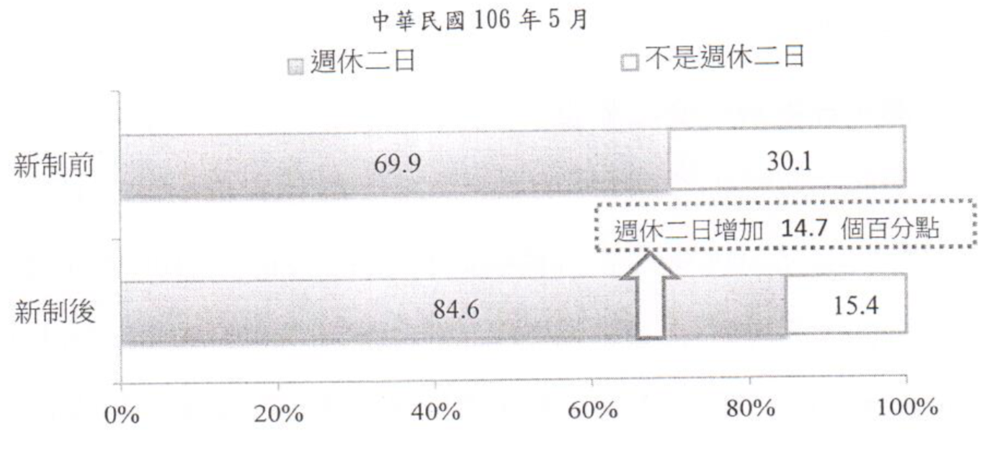
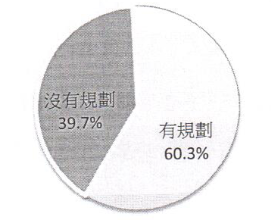
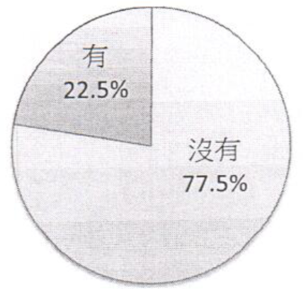

## 五、《勞動基準法》週休二日新制施行後對勞動條件之影響

### （一）新制施行後整體工資及工時之變化

依據行政院主計總處「受僱員工薪資調查」統計資料顯示，自106年1月1日起，實施《勞動基準法》週休二日新制後，106年1至8月與105年同期比較，工業及服務業平均每人每月總薪資增加2.41%，加班費增加7.41%，正常工時減少1.4%，加班工時減少0.2%。

### （二）新制施行後加班費之變化

就上開行政院主計總處「受僱員工薪資調查」進一步分析，以個別行業別之加班費而言，週休二日新制實施後，106年1月至8月對比105年1月至8月加班費之觀察，加班費增加20%以上的行業，於工業部門為電力及燃氣供應業、礦業及土石採取業，服務業部門為住宿及餐飲業、批發及零售業，惟醫療保健服務業、不動產業、其他服務業、及藝術娛樂及休閒服務業，加班費則呈現負成長。

### （三）新制施行後加班工時之變化

再就個別行業別之加班時數而言，多數行業之加班工時雖略有減少，惟工業部門中之礦業及土石採取業增加0.8%、電力及燃氣供應業增加2.0%；服務業部門中之批發及零售業、金融保險業、住宿及餐飲業仍分別增加0.1%，顯見部分產業仍有加班之實際需求。

### （四）新制施行前後，受僱勞工週休二日情形

1. 依據本部「106年5月勞動基準法週休二日修法意見調查」結果顯示，週休二日新制施行前，有69.9%受僱勞工其工作為週休二日，施行後上升至84.6%，增加14.7%。

<figure>
  
  <figcaption>圖1、新制施行前後，受僱勞工週休二日情形</figcaption>
</figure>

2. 按職業觀察，週休二日增加幅度較高者，以「技藝有關工作人員」增加21.%、「機械設備操作及組裝人員」增加19.9%及「基層技術工及勞力工」增加19.1%較多。

3. 按行業別觀察，週休二日增加幅度較高有「住宿及餐飲業」增加23.6%、「其他服務業」增加20.1%、「醫療保健及社會工作服務業」增加20.0%。

4. 按服務單位規模別觀察，員工規模愈小週休二日增加幅度愈高，「29人以下」增加17.8%、「30〜99人」增加13.6%、「100〜249人」增加10.1%、「250人以上」增加9.1%。

<table class="table table-bordered table-hover table-condensed">
  <caption>表1、新制施行前後，受僱勞工之週休二日情形</caption>
  <thead>
    <tr>
      <th>項目別</th>
      <th>新制前</th>
      <th>新制後</th>
      <th>增減百分點</th>
    </tr>
  </thead>
  <tbody>
    <tr>
      <td><strong>合計</strong></td>
      <td><strong>69.9</strong></td>
      <td align="right"><strong>84.6</strong></td>
      <td><strong>14.7</strong></td>
    </tr>
    <tr>
      <td><strong>性別</strong></td>
      <td align="right"></td>
      <td align="right"></td>
      <td align="right"> align="right"</td>
    </tr>
    <tr>
      <td>男性</td>
      <td align="right">66.3</td>
      <td align="right">81.3</td>
      <td align="right">15</td>
    </tr>
    <tr>
      <td>女性</td>
      <td align="right">74.2</td>
      <td align="right">88.6</td>
      <td align="right">14.4</td>
    </tr>
    <tr>
      <td><strong>教育程度</strong></td>
      <td align="right"></td>
      <td align="right"></td>
      <td align="right"></td>
    </tr>
    <tr>
      <td>國中及以下</td>
      <td align="right">53</td>
      <td align="right">73.5</td>
      <td align="right">20.5</td>
    </tr>
    <tr>
      <td>高中（職）</td>
      <td align="right">63.2</td>
      <td align="right">82.3</td>
      <td align="right">19.1</td>
    </tr>
    <tr>
      <td>專科</td>
      <td align="right">74</td>
      <td align="right">87.6</td>
      <td align="right">13.6</td>
    </tr>
    <tr>
      <td>大學</td>
      <td align="right">80.4</td>
      <td align="right">89.4</td>
      <td align="right">9</td>
    </tr>
    <tr>
      <td>碩士及以上</td>
      <td align="right">85.6</td>
      <td align="right">93.2</td>
      <td align="right">7.6</td>
    </tr>
    <tr>
      <td><strong>職業別</strong></td>
      <td align="right"></td>
      <td align="right"></td>
      <td align="right"></td>
    </tr>
    <tr>
      <td>主管及經理人員</td>
      <td align="right">85.3</td>
      <td align="right">95.4</td>
      <td align="right">10. 1</td>
    </tr>
    <tr>
      <td>專業人員</td>
      <td align="right">78.6</td>
      <td align="right">88.5</td>
      <td align="right">9.9</td>
    </tr>
    <tr>
      <td>技術員及助理專業人員</td>
      <td align="right">80.1</td>
      <td align="right">92</td>
      <td align="right">11.9</td>
    </tr>
    <tr>
      <td>事務支援人員</td>
      <td align="right">87.2</td>
      <td align="right">95.7</td>
      <td align="right">8.5</td>
    </tr>
    <tr>
      <td>服務及銷售工作人員</td>
      <td align="right">60.5</td>
      <td align="right">74.9</td>
      <td align="right">14.4</td>
    </tr>
    <tr>
      <td>*農、林、漁、牧業生產人員</td>
      <td align="right">19.3</td>
      <td align="right">25.5</td>
      <td align="right">6.2</td>
    </tr>
    <tr>
      <td>技藝有關工作人員</td>
      <td align="right">49.5</td>
      <td align="right">71.4</td>
      <td align="right">21.9</td>
    </tr>
    <tr>
      <td>機械設備操作及組裝人員</td>
      <td align="right">69.7</td>
      <td align="right">89.6</td>
      <td align="right">19.9</td>
    </tr>
    <tr>
      <td>基層技術工及勞力工</td>
      <td align="right">56.2</td>
      <td align="right">75.3</td>
      <td align="right">19.1</td>
    </tr>
    <tr>
      <td><strong>行業別</strong></td>
      <td align="right"></td>
      <td align="right"></td>
      <td align="right"></td>
    </tr>
    <tr>
      <td>*農、林、漁牧業</td>
      <td align="right">44.5</td>
      <td align="right">67.9</td>
      <td align="right">23.4</td>
    </tr>
    <tr>
      <td>*礦業及土石採取業</td>
      <td align="right">44</td>
      <td align="right">59.7</td>
      <td align="right">15.7</td>
    </tr>
    <tr>
      <td>製造業</td>
      <td align="right">78.1</td>
      <td align="right">93.6</td>
      <td align="right">15.5</td>
    </tr>
    <tr>
      <td>*電力及燃氣供應業</td>
      <td align="right">85.7</td>
      <td align="right">95.7</td>
      <td align="right">10</td>
    </tr>
    <tr>
      <td>*用水供應及污染整治業</td>
      <td align="right">43.5</td>
      <td align="right">87.6</td>
      <td align="right">44.1</td>
    </tr>
    <tr>
      <td>營建工程業</td>
      <td align="right">47</td>
      <td align="right">65.4</td>
      <td align="right">18.4</td>
    </tr>
    <tr>
      <td>批發及零售業</td>
      <td align="right">67.1</td>
      <td align="right">82.3</td>
      <td align="right">15.2</td>
    </tr>
    <tr>
      <td>運輸及倉儲業</td>
      <td align="right">67.7</td>
      <td align="right">81.6</td>
      <td align="right">13.9</td>
    </tr>
    <tr>
      <td>住宿及餐飲業</td>
      <td align="right">56.6</td>
      <td align="right">80.2</td>
      <td align="right">23.6</td>
    </tr>
    <tr>
      <td>出版、影音製作、傳播及資通訊服務業</td>
      <td align="right">91.8</td>
      <td align="right">94</td>
      <td align="right">2.2</td>
    </tr>
    <tr>
      <td>金融及保險業</td>
      <td align="right">94.9</td>
      <td align="right">94.9</td>
      <td align="right">—</td>
    </tr>
    <tr>
      <td>*不動產業</td>
      <td align="right">58.5</td>
      <td align="right">78.6</td>
      <td align="right">20.1</td>
    </tr>
    <tr>
      <td>專業、科學及技術服務業</td>
      <td align="right">84. 1</td>
      <td align="right">91.7</td>
      <td align="right">7.6</td>
    </tr>
    <tr>
      <td>支援服務業</td>
      <td align="right">71.3</td>
      <td align="right">79.7</td>
      <td align="right">8.4</td>
    </tr>
    <tr>
      <td>教育業</td>
      <td align="right">77.4</td>
      <td align="right">83.9</td>
      <td align="right">6.5</td>
    </tr>
    <tr>
      <td>醫療保健及社會工作服務業</td>
      <td align="right">61.5</td>
      <td align="right">81.5</td>
      <td align="right">20</td>
    </tr>
    <tr>
      <td>*藝術、娛樂及休閒服務業</td>
      <td align="right">58.6</td>
      <td align="right">62.3</td>
      <td align="right">3.7</td>
    </tr>
    <tr>
      <td>其他服務業</td>
      <td align="right">45.6</td>
      <td align="right">65.7</td>
      <td align="right">20.1</td>
    </tr>
    <tr>
      <td><strong>服務單位規模別</strong></td>
      <td align="right"></td>
      <td align="right"></td>
      <td align="right"></td>
    </tr>
    <tr>
      <td>29人以下</td>
      <td align="right">61.5</td>
      <td align="right">79.3</td>
      <td align="right">17.8</td>
    </tr>
    <tr>
      <td>30-99 A</td>
      <td align="right">75.2</td>
      <td align="right">88.8</td>
      <td align="right">13. 6</td>
    </tr>
    <tr>
      <td>100-249 A</td>
      <td align="right">81.3</td>
      <td align="right">91.4</td>
      <td align="right">10.1</td>
    </tr>
    <tr>
      <td>250人以上</td>
      <td align="right">84</td>
      <td align="right">93.1</td>
      <td align="right">9.1</td>
    </tr>
  </tbody>
</table>
說明：「*」表示樣本數不足30人抽樣誤差大，故不列入分析項目。

### （五）新制施行後，受僱勞工工資及工時變動情形-「106年5月勞動基準法週休二日修法意見調查」

1. 整體工作時間：維持不變者占76.3%，增加者占3.7%（新制因素2.6%+其他因素1.1%），減少者占20.2%（新制因素18.5%+其他因素1.5%）。

2. 整體加班工時：維持不變者占77.8%，增加者占4.0%（新制因素2.7%+其他因素1.3%），減少者占18.1%（新制因素16.8%+其他因素1.3%）。

3. 休息日加班時數：維持不變者占79.7%，增加者占4.1%（新制因素3.0%+其他因素1.1%），減少者占16.1°/。（新制因素14.6%+其他因素1.5%）。

4. 休息日加班費：維持不變者占75.1%，增加者占11.6%（新制因素10.2%+其他因素1.4%），減少者占13.3%（新制因素11.5%+其他因素1.8%）。

<table class="table table-bordered table-hover table-condensed">
  <caption>表2、新制施行後，受僱勞工之勞動條件變動情形 中華民國106年5月，單位：%</caption>
  <thead>
    <tr>
      <th rowspan="2">項目別</th>
      <th rowspan="2">總計</th>
      <th rowspan="2">不變</th>
      <th colspan="2">增加</th>
      <th colspan="2">減少</th>
      <th rowspan="2">不知道</th>
    </tr>
  </thead>
  <tbody>
    <tr>
      <td>新制因素</td>
      <td>其他因素（含不知道）</td>
      <td>新制因素</td>
      <td>其他因素（含不知道）</td>
    </tr>
    <tr>
      <td>整體工作時間</td>
      <td align="right">100</td>
      <td align="right">76.3</td>
      <td>2.6</td>
      <td>1.1</td>
      <td>18.5</td>
      <td>1.5</td>
      <td>-</td>
    </tr>
    <tr>
      <td>整體加班工時</td>
      <td align="right">100</td>
      <td align="right">77.8</td>
      <td>2.7</td>
      <td>1.3</td>
      <td>16.8</td>
      <td>1.3</td>
      <td>-</td>
    </tr>
    <tr>
      <td>休息日加班時數</td>
      <td align="right">100</td>
      <td align="right">79.7</td>
      <td>3</td>
      <td>1.1</td>
      <td>14.6</td>
      <td>1.5</td>
      <td>-</td>
    </tr>
    <tr>
      <td>休息日加班費</td>
      <td align="right">100</td>
      <td align="right">75.1</td>
      <td>10.2</td>
      <td>1.4</td>
      <td>11.5</td>
      <td>1.8</td>
      <td>-</td>
    </tr>
  </tbody>
</table>

### （六）因休息日加班費或加班機會減少之勞工，想兼職增加收入之情形

其中有60.3%受僱勞工因為休息日加班費或加班機會減少而想兼職增加收入，39.7%沒有如此規劃。

<figure>
  
  <figcaption>圖2、因休息日加班費或加班機會減少而想兼職增加收入情形（中華民國106年5月）</figcaption>
</figure>

### （七）受僱勞工對特休假日數保留至其他（下一）年度請休之需求情形

勞動基準法規定自今（106）年起未休完特休假日數，雇主要折發工資，22.5%受僱勞工有將特休假日數保留至其他（下一）年度請休之需求，77.5%沒有需求。

<figure>
  
  <figcaption>圖3、對特休假日數保留至其他（下一）年度請休之需求情形（中華民國106年5月）</figcaption>
</figure>

### （八）受僱勞工於兩個事業單位以上投保勞工保險之數據變化

自106年1月1日，實施《勞動基準法》週休二日新制後，106年1至8月與105年同期比較，受僱勞工於兩個事業單位以上投保勞工保險之人數增加12,658人，約增加14.84%。

<table class="table table-bordered table-hover table-condensed">
  <caption>表3、於2個以上僱用單位投保之被保險人數統計表</caption>
  <thead>
    <tr>
      <th rowspan="2">資料月份</th>
      <th rowspan="2">一般僱用單位被保險人數</th>
      <th colspan="3">於2個以上僱用單位投保之被保險人數</th>
    </tr>
    <tr>
      <th>人數</th>
      <th>百分比</th>
      <th>平均</th>
    </tr>
  </thead>
  <tbody>
    <tr>
      <td align="right">10501</td>
      <td>7,423,522</td>
      <td>76388</td>
      <td>1.03%</td>
      <td colspan="8">平均人數85,254</td>
    </tr>
    <tr>
      <td align="right">10502</td>
      <td>7,384,722</td>
      <td>86354</td>
      <td>1.17%</td>
    </tr>
    <tr>
      <td align="right">10503</td>
      <td>7,411,980</td>
      <td>91,087</td>
      <td>1.23%</td>
    </tr>
    <tr>
      <td align="right">10504</td>
      <td>7,433,508</td>
      <td>92372</td>
      <td>1.24%</td>
    </tr>
    <tr>
      <td align="right">10505</td>
      <td>7434977</td>
      <td>92661</td>
      <td>1.25%</td>
    </tr>
    <tr>
      <td align="right">10506</td>
      <td>7393651</td>
      <td>79,488</td>
      <td>1.08%</td>
    </tr>
    <tr>
      <td align="right">10507</td>
      <td>7,455,599</td>
      <td>80857</td>
      <td>1.08%</td>
    </tr>
    <tr>
      <td align="right">10508</td>
      <td>7475789</td>
      <td>82,824</td>
      <td>1.11%</td>
    </tr>
    <tr>
      <td align="right">10601</td>
      <td>7536641</td>
      <td>84,424</td>
      <td>1.12%</td>
      <td rowspan="8">平均人數 97,912 較去年同期增加14.84%</td>
    </tr>
    <tr>
      <td align="right">10602</td>
      <td>7538657</td>
      <td>97225</td>
      <td>1.29%</td>
    </tr>
    <tr>
      <td align="right">10603</td>
      <td>7579637</td>
      <td>102,451</td>
      <td>1.35%</td>
    </tr>
    <tr>
      <td align="right">10604</td>
      <td>7603428</td>
      <td>105,148</td>
      <td>1.38%</td>
    </tr>
    <tr>
      <td align="right">10605</td>
      <td>7603741</td>
      <td>105,065</td>
      <td>1.38%</td>
    </tr>
    <tr>
      <td align="right">10606</td>
      <td>7565066</td>
      <td>90863</td>
      <td>1.20%</td>
    </tr>
    <tr>
      <td align="right">10607</td>
      <td>7631976</td>
      <td>93,727</td>
      <td>1.23%</td>
    </tr>
    <tr>
      <td align="right">10608</td>
      <td>7665168</td>
      <td>104,394</td>
      <td>1.36%</td>
    </tr>
  </tbody>
</table>

資料來源：勞保局
