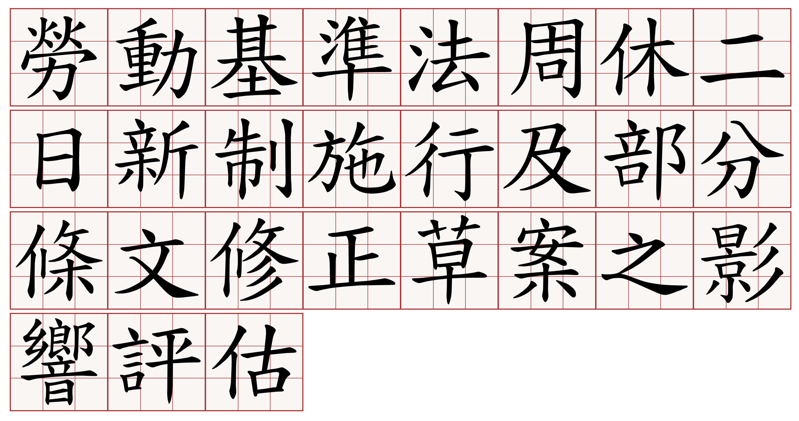

# 勞動基準法周休二日新制施行及部分條文修正草案之影響評估

**勞動部**

《勞動基準法》係規範勞動條件最低標準，為受僱者勞動條件之基本法，其立法目的在於保障勞工權益，加強勞雇關係，並促進社會與經濟發展。由於凡屬適用勞動基準法之行業或工作者，不分行業性質、工作者特性或事業單位規模大小，均應適用同一部法令，然各行各業本即存有本質上的差異，部分產業之運作困難，仍應同受重視，考量於合理範圍内給予適度彈性調整之空間，避免過於僵化而無彈性之法令，因運作上窒礙難行，反而無法保障勞工權益，爰從法制面著手，檢討現行《勞動基準法》條文，建構務實可行並具備安全彈性之勞動制度，以確保勞工基本勞動權益獲得完整保障。

檔案來源：[沃草](https://www.facebook.com/watchout.tw/posts/875565729268308)

## 相關資源

* [PDF](files/勞動基準法周休二日新制施行及部分條文修正草案之影響評估.pdf)
